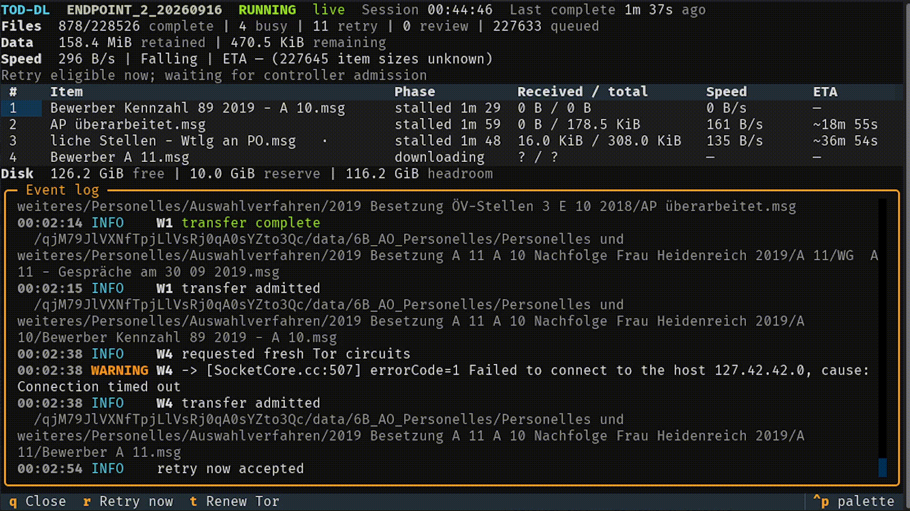

# TOD-DL

TOD-DL is a resumable forensic download-manager for a defined `.onion`-URL
queue. The Tor-Onion-Dump-Downloader protects existing final files, records
durable state in SQLite, and creates signed provenance records for completed
files.

> **Warning:** Use TOD-DL only for material that you are authorized to acquire
> and retain.



## Repository contents

The repository contains downloader source code and test fixtures. It does not
contain downloaded data, queue files, download state, or derived content.

- `src/tod-dl.py` runs the bounded downloader.
- `run.sh` runs the downloader with the local queue file.
- `src/monitor.py` displays the read-only telemetry snapshot.
- `src/verify_provenance.py` verifies a signed provenance record set.
- `tests/` contains tests and non-sensitive fixtures.
- `src/acquisition_evaluation.py` provides local acquisition-engine fixtures.

## Requirements

You need Python 3, `aria2c`, `torsocks`, and a local Tor service. The Tor
ControlPort must use `IsolateSOCKSAuth`. The downloader reads the Tor control
cookie from `/run/tor/control.authcookie` by default.

Create the downloader environment with these commands:

```bash
python3 -m venv .venv
. .venv/bin/activate
python3 -m pip install -r requirements-downloader.txt
```

Create a separate monitor environment when you use the Textual monitor:

```bash
python3 -m venv .venv-monitor
. .venv-monitor/bin/activate
python3 -m pip install -r requirements-monitor.txt
```

## Prepare a queue

Each queue file contains one URL per line. Blank lines, comment lines,
duplicate URLs, unsafe paths, URLs with credentials, and URLs with query
values are ignored or rejected.

A URL has the form `https://HOST/COLLECTION/PATH`. The `/data/` segment is
optional. The final path is `COLLECTION/PATH`, so a URL with `/data/` keeps
`data` in the final path. A URL with only a collection, or with `ALL_FILES` as
the file, is rejected. A URL is also rejected if a decoded segment makes the
path absolute (for example `/%2Fetc/passwd` or `//passwd`), contains `..`, or
contains a NUL byte. Such a path could leave the destination directory.

A line can carry optional `key=value` tokens after the URL, separated by
whitespace, in any order:

- `size=<token>`: a rough, human-readable size estimate, for example `1.8M`
  or `43K`. The downloader does not parse or validate this value beyond
  rejecting an empty one; it stores the token as given.
- `sha256=<hex>`: the expected 64-character hex SHA-256 digest. If the
  downloaded file's digest does not match, the downloader moves the file to
  a review candidate instead of promoting it.
  A later queue that gives an existing item a different `size=` or `sha256=`
  value replaces the stored value.
- `generation=<id>`: an opaque source-generation identifier that the queue
  producer sets, for example the inventory snapshot hash. The downloader
  stores it per item. If a later run gives an `unavailable` item a different
  identifier, the item's daily recheck runs early. The early recheck counts as
  that day's recheck. Unless a later run gives another differing identifier,
  the next recheck waits a full day after it.

Example: `https://example.onion/data/case/file.bin size=1.8M
sha256=9f86d081884c7d659a2feaa0c55ad015a3bf4f1b2b0b822cd15d6c15b0f00a08`

Store queue files outside this source repository when they contain case data.

## Run an acquisition

Start with a dry run. The dry run reads queues and reports the selected final
paths. It does not start Tor, `aria2c`, or a source request.

```bash
python3 src/tod-dl.py \
    --queue /case/urls_priority.txt \
    --destination /case/downloaded_files \
    --state /case/download-state \
    --dry-run --max-files 3
```

After an operator reviews the paths and storage, start a bounded run:

```bash
python3 src/tod-dl.py \
    --queue /case/urls_priority.txt \
    --destination /case/downloaded_files \
    --state /case/download-state \
    --workers 4 --max-files 5
```

The destination and state directories must use the same filesystem. The
controller keeps a 10 GiB free-space reserve by default. It never replaces an
existing final. A collision creates a review item and preserves incoming bytes
under `download-state/redownload-candidates/`. The controller hashes one
staged file at a time; a lagging hash holds its worker slot and pauses new
admission until the hash finishes.

## Recover from low storage

The controller stops admission when free space at the destination and state
filesystem falls below the reserve (10 GiB by default). No queued transfer
starts until space is available again. An admitted transfer that hits
`ENOSPC` mid-transfer resets to `queued` without consuming a retry attempt.

To recover, free space on the destination filesystem, then resume the run
with the same run ID as shown above. The controller re-checks free space
before it admits the next transfer; no restart-specific flag is needed.

## Review a candidate

An item enters `review_required` when TOD-DL cannot safely promote it
automatically: a checksum mismatch, a name that exceeds the filesystem limit
(`ENAMETOOLONG`), an incomplete body after a single retry, or (for a resumed
transfer with a recorded ETag or Last-Modified baseline) a changed or
unconfirmed remote representation. Use `--status` to list `review_required`
items and read each item's `review_code` and `last_error`.

Three row-scoped actions apply to a `review_required` item. Each is durable and
confirmed before the controller applies them:

- `exclude_item` durably moves the item to `excluded`. It leaves every other
  item's state, selected set, and queue rank unchanged, and it never fires
  automatically from any outage, retry, validation, or promotion path. In
  the monitor's Queue tab (`src/monitor.py --control`), select the item and
  press `x`, then confirm.
- `resume_new_generation` applies only to a `changed_remote_representation`
  or `no_reliable_version_protection` review item. It clears the review code
  and returns the item to `queued` under a new staging generation, so the
  next attempt starts a fresh download instead of resuming stale bytes. In
  the monitor's Queue tab (`src/monitor.py --control`), select the item and
  press `N`, then confirm. The key is offered only for a row in the
  `review_required` bucket; the controller still rejects an item with any
  other review code.
- `retry_access_denied` applies only to an `access_denied` review item (an
  HTTP 401 or 403). It returns the item to `queued` and keeps its staged
  bytes, attempts, and staging generation. The origin pause ends when no
  other `access_denied` item of that origin remains. A repeated 401 or 403
  pauses the origin again. In the monitor's Queue tab (`src/monitor.py
  --control`), select the item and press `A`, then confirm. The key is
  offered only for a row in the `review_required` bucket; the controller
  still rejects an item with any other review code.

## Resume a run

Use the same run ID, queue files, and `--max-files` value to resume a stopped
run. The downloader binds the run ID to queue file hashes and the selection
value. A retry cannot add a later queue item to the selected set.

```bash
python3 src/tod-dl.py \
    --queue /case/urls_priority.txt \
    --destination /case/downloaded_files \
    --state /case/download-state \
    --run-id RUN_ID --max-files 5 --retry-now
```

A stop that you request (SIGTERM, SIGINT, a control-UI stop, or `--time-limit`)
keeps the partial file and schedules no retry delay. The resumed run continues
the item at once, and the source answers the resume with an HTTP 206 range
response. A source failure still waits 1, 2, 4, then more minutes. The
`--retry-now` flag ends that wait early.

Use `--status` to read persisted state without starting transfers.

## Monitor and control a run

The monitor reads a published telemetry snapshot. It does not open the
acquisition database or write final provenance.

```bash
python3 src/monitor.py --state /case/download-state \
    --run-id RUN_ID --control
```

With `--control`, every action below needs confirmation before the
controller runs it.

- Press `r` to make selected retryable items eligible now.
- Press `t` to request fresh Tor circuits for future streams. This does not
  change active transfers or prove a new route. The controller applies the
  configured rate limit, which defaults to 60 seconds.
- Press `p` to pause admission. Active transfers keep running; the
  controller admits no new transfer until you resume.
- Press `u` to resume admission for the current run.
- Press `d` to drain and stop the run. Admission stops now. Active
  transfers finish to a durable state, then the run exits. You cannot undo
  this action.
- Press `k` to checkpoint and stop the run. The controller checkpoints and
  terminates active transfers immediately, then the run exits. You cannot
  undo this action.

The controller records every request it accepts, with its outcome and a
durable state revision.

## Verify provenance

The controller writes signed record sets below
`download-state/provenance/<run-id>/<session-id>/`. Keep the trusted Ed25519
public key or its fingerprint outside the record directory.

Run the verifier to check the signature, event chain, final paths, byte counts,
and SHA-256 digests. The verifier does not modify downloaded files. The
verifier always needs `--public-key`. Add `--expected-fingerprint` to pin that
key to a fingerprint you keep elsewhere. A fingerprint alone fails, because it
cannot verify the signature.

```bash
python3 src/verify_provenance.py \
    /case/download-state/provenance/RUN_ID/SESSION_ID \
    --destination /case/downloaded_files \
    --public-key /secure/TRUSTED_PUBLIC_KEY.pem
```

## Test the source

Run the complete test set before you change downloader behavior:

```bash
python3 -m unittest -v tests/test_tod_dl.py tests/test_monitor.py
python3 -m unittest -v tests/test_acquisition_evaluation.py
python3 -m py_compile src/tod-dl.py src/acquisition_evaluation.py
bash -n ./run.sh
git diff --check
```

## Test the acquisition fixture harness

Run the local self-test before you create a transfer-engine adapter. The
self-test starts a loopback HTTP fixture server. It generates only synthetic
bytes. It does not start `aria2c`, `torsocks`, Tor, or a source request.

```bash
python3 src/acquisition_evaluation.py \
    --self-test --output /tmp/tod-dl-evaluation
```

The output directory must be empty. The self-test writes an immutable fixture
manifest, a machine-readable fixture event log, and a structured report. It
does not select an engine. An engine becomes selected only after E01 through
E14 pass and meet all evaluation targets.

## Build a queue from an inventory listing

`src/inventory.py` reads a local `ls -R`-style listing, writes a reproducible
manifest, and exports a queue. It reads local files only and never replaces an
existing file. Use a case directory for all paths.

```bash
python3 src/inventory.py snapshot --input /case/ALL_FILES1 --store /case/inventory
python3 src/inventory.py activate --store /case/inventory --snapshot <sha256-prefix>
python3 src/inventory.py manifest --snapshot /case/inventory/snapshots/<name> \
    --policy /case/policy.json --base-url https://HOST/COLLECTION \
    --output /case/manifests/m1
python3 src/inventory.py queue --manifest /case/manifests/m1 --output /case/urls_1.txt
```

After you import a newer listing, compare it with the old one:

```bash
python3 src/inventory.py diff --old /case/inventory/snapshots/<old> \
    --new /case/inventory/snapshots/<new> --output /case/diffs/d1
```

`report.md` in the output directory is the dated report. A removed path does
not authorize local deletion. Review every `ambiguous` item.

A rejected snapshot lands in `rejected/` and cannot become a baseline. Read
its `parse-report.json` before you use `--max-issues`. The policy file assigns
each item to `priority`, `deferred`, or `rejected`; the specification shows
the format. `queue --disposition deferred` exports the deferred items. The
`--generation` option adds a `generation=` token to each line; use it only
when you want the downloader to run early rechecks. Read
[the specification](specs/SPEC-inventory-snapshot-manifest.md) for the
runbook.

## Development status

Read [open development work](specs/OPEN-WORK.md) for the current implementation
state and the planned work that remains, including
[inventory discovery](specs/SPEC-inventory-discovery.md) and the
[on-demand target-directory rescan](specs/SPEC-target-dir-rescan.md) that
depends on it.

The [console UI specification](specs/SPEC-console-ui.md) defines planned
[item details](specs/SPEC-console-item-details.md),
[worker details](specs/SPEC-console-worker-details.md), and the
[queue view](specs/SPEC-console-queue.md). These views require the planned
[read-only inspection service](specs/SPEC-console-inspection.md).
The current monitor does not implement these views.

The acquisition-engine evaluation is local-only. It needs no onion target and
does not permit a source request. Read the
[acquisition-tool evaluation specification]
(specs/SPEC-acquisition-tool-evaluation.md) before you implement or run the
evaluation. A separate source pilot ran on 2026-09-18 with an explicit
operator instruction. Its results are in
[the source pilot report](specs/reports/source-pilot-2026-09-18.md).

## Portfolio project

TOD-DL demonstrates durable acquisition design for forensic work. It includes
SQLite state recovery, no-overwrite finalization, SHA-256 validation, signed
provenance, Tor isolation checks, a read-only monitor, local control actions,
and deterministic acquisition-engine fixtures.

This portfolio project is an example of auditable safety-focused systems work.
TOD-DL is neither production-ready nor fully specification-complete.

## License

The [TOD-DL Non-Commercial License](LICENSE) permits personal, educational,
and portfolio-review use. Commercial use and redistribution need prior written
permission from the copyright holder.

## Next steps

Create download queues outside the repository. Run a dry run and review
the selected paths before you start an acquisition.
