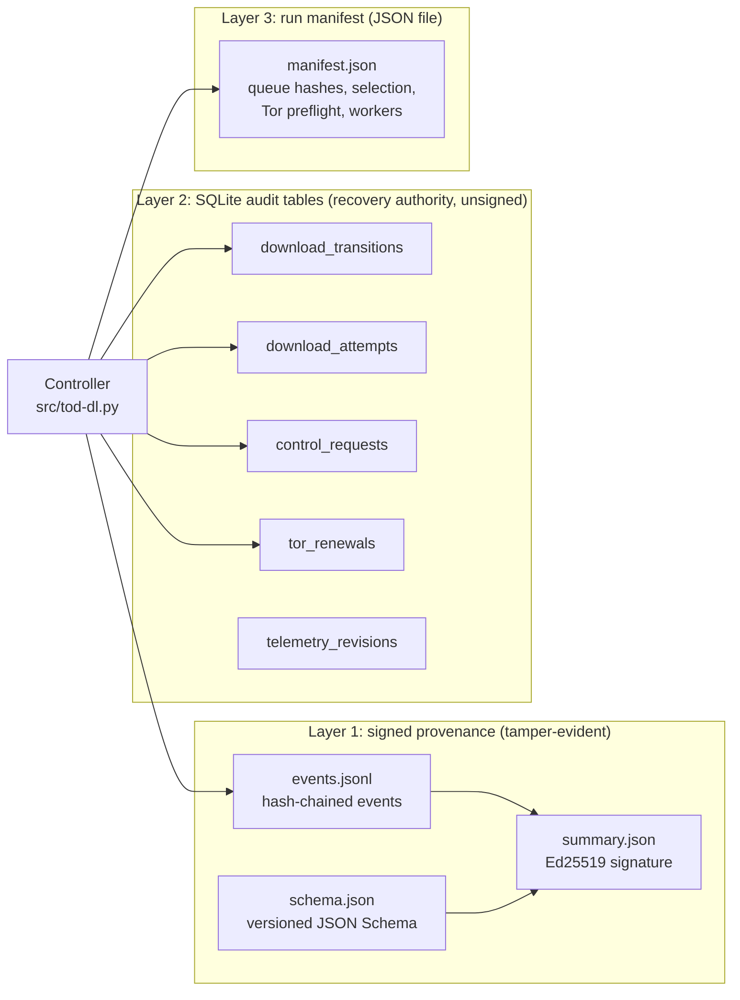
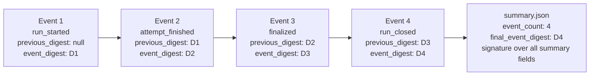
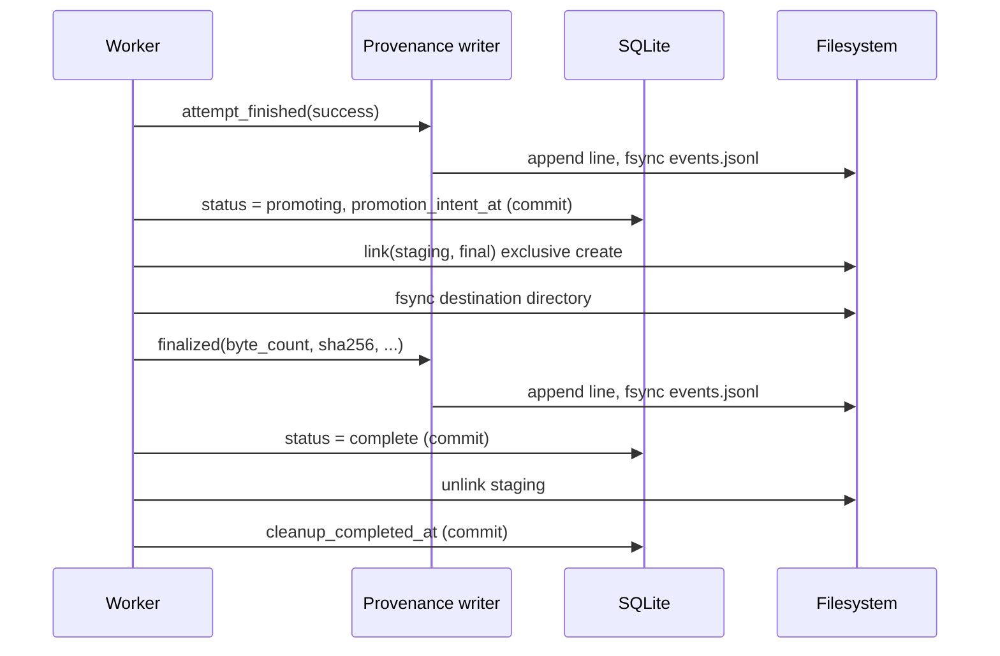

# Audit rail

Status: describes the code as of 2026-09-18 (commit `d25e07c` plus the
working tree). Sections marked **Planned** describe work that does not exist.

The audit rail is the set of records that TOD-DL writes so that a reviewer can
answer one question later: what did the controller do, in what order, and can
someone prove that no one changed the record?

This document explains the records, the write order, the verifier, and the
known gaps. [CHAIN-OF-CUSTODY.md](CHAIN-OF-CUSTODY.md) follows one file from
queue line to final path. [specs/SPEC-acquisition-provenance.md](../specs/SPEC-acquisition-provenance.md)
is the normative contract.

## Summary

| Question | Answer |
| --- | --- |
| What records exist? | Three layers: signed provenance files, SQLite audit tables, a run manifest. |
| Which layer is tamper-evident? | Only the signed provenance files. |
| Which layer is the recovery authority? | SQLite (`manifest.sqlite`). |
| What does the signature cover? | The session summary, which holds the final event digest. |
| What does the tool never record? | Cookies, authorization values, Tor control cookies, RPC secrets, monitor tokens, user-info URLs. |
| What can the record not prove? | That the source served an original or complete collection. |

## The three layers



### Layer 1: signed provenance

Code: `src/provenance.py` (writer), `src/verify_provenance.py` (verifier).
Location: `download-state/provenance/<run-id>/<session-id>/`.

A session is one start of the controller. Each session gets its own
directory, created with mode `0700`. Each file inside has mode `0600`.

| File | Content | Written |
| --- | --- | --- |
| `events.jsonl` | One JSON object per line. Append-only. | One line per event, fsynced. |
| `schema.json` | JSON Schema (Draft 2020-12) and the canonicalization name `JCS-RFC8785`. | At session start. |
| `summary.json` | Event count, final event digest, queue input digests, selection settings, outcome counts, the session finalized count, schema hash, key fingerprint, signature. | At session close. |

#### Event types

| Event | Meaning | Key fields |
| --- | --- | --- |
| `run_started` | The session began. | `queue_input_digests`, `selection_settings`, `selected_item_count` |
| `attempt_finished` | One request attempt ended. | `item_id`, `source_url`, `attempt_number`, `request_started_at`, `request_finished_at`, `final_url`, `redirect_chain`, `http_status`, `outcome`, response headers |
| `finalized` | A file reached its final path. | `item_id`, `logical_relative_path`, `final_relative_path`, `byte_count`, `sha256`, `validation_method_version`, four validation objects |
| `candidate_created` | Bytes went to review instead of a final path. | `item_id`, `staging_relative_path`, `candidate_relative_path`, `sha256` (or `null`), `finalization_failure_reason` |
| `run_closed` | The session ended. | `closed_at`, `close_reason`, `durable_outcome_counts` |
| `local_failure` | A local fault such as disk full. | `failure_code`, `failure_detail` |

An attempt `outcome` is one of `success`, `retryable_failure`, `unavailable`,
`access_denied`, `validation_failed`, or `stopped`. A close reason is one of
`finished`, `stopped`, `time_limit`, `local_failure`, or `interrupted`.

Each `finalized` event carries four validation objects: `expected_size`,
`expected_checksum`, `etag`, and `last_modified`. Each object has `available`,
`compared`, and `value`. The record therefore states not only what the
controller knew, but also whether it compared the value. If `available` is
false, the value is `null` and `compared` is false. The verifier enforces this
rule.

#### The digest chain

Every event carries the digest of the event before it.



- The controller builds the event without `event_digest`.
- It encodes the event as canonical JSON (sorted keys, no spaces, UTF-8, no
  floats).
- It computes `event_digest` as the SHA-256 of those bytes.
- It writes the event with `event_digest` included.

A change to any field of an event changes its digest. A change to a digest
breaks the `previous_digest` of the next event. The signature covers the final
digest. So the chain, the summary, and the signature protect each other.

#### The signature

- Algorithm: Ed25519.
- The signed message is the canonical JSON of the summary without the
  `signature` field.
- The signature is 64 bytes, encoded as unpadded base64url (86 characters).
- The key fingerprint is the SHA-256 of the 32 raw public-key bytes.
- The default private key path is `download-state/provenance-signing-key.pem`.
  The `--provenance-signing-key` option sets another path. The controller
  creates the key on first use.

### Layer 2: SQLite audit tables

Code: `SCHEMA` and `RUN_SCHEMA` in `src/tod-dl.py`. These tables are not
signed and not chained. They are the recovery authority: after a crash, the
controller reads them to decide what to do next.

| Table | Records | Written when |
| --- | --- | --- |
| `download_transitions` | Every status change of an item: `from_status`, `to_status`, `detail`, `recorded_at`. | In the same transaction as the status change (`transition()`). |
| `download_attempts` | Each attempt: start, end, outcome. | At attempt start and end. |
| `control_requests` | Each operator control request: `request_id`, `action`, `outcome`, `reason`, `state_revision`, `session_id`. | In the same transaction as the control effect. A repeated `request_id` returns the first result. |
| `tor_renewals` | Each Tor circuit renewal request and its rate-limit result. | At the request. |
| `telemetry_revisions` | The run revision counter. | With every state change. |

The `downloads` table holds the current state of each item. The transition
and attempt tables hold the history. The controller writes a status change and
its transition row in one SQLite transaction, so the two cannot disagree.

### Layer 3: run manifest

Code: `write_manifest()` in `src/tod-dl.py`. The file `manifest.json` holds
the run ID, start and finish times, queue file hashes, the selection value
(`max_files`), the Tor isolation preflight (SOCKS ports), and the worker
list. On resume, the controller compares the queue hashes and the selection
value with the stored ones. A mismatch stops the resume. This rule prevents
a later queue item from entering the selected set.

## Write order

The rule is: write the evidence record first, then change the state that
depends on it. The provenance writer fsyncs each event before the controller
commits the related SQLite state.



If the provenance write fails, the controller stops new admission and records
a local failure. The writer rejects an event that does not match the schema
and does not write it.

## The verifier

Run:

```bash
python3 src/verify_provenance.py \
    /case/download-state/provenance/RUN_ID/SESSION_ID \
    --destination /case/downloaded_files \
    --public-key /secure/TRUSTED_PUBLIC_KEY.pem \
    --expected-fingerprint <fingerprint you kept elsewhere>
```

The exit status is 0 when all checks pass and 1 otherwise. The verifier
prints `OK: provenance record set verified` or one `FAIL:` line for each
problem. The verifier never changes, renames, or deletes a file.

### Checks

1. `schema.json` equals the schema the verifier knows, and its SHA-256 equals
   `schema_sha256` in the summary.
2. The summary has exactly the required fields, and its IDs match the
   directory path.
3. The public key fingerprint equals the summary fingerprint (and equals
   `--expected-fingerprint` if given).
4. The Ed25519 signature is valid.
5. Each event line is valid JSON with no duplicate keys.
6. Each event matches its schema branch and has no unknown field.
7. The sequence starts at 1 and has no gap.
8. No event ID repeats.
9. Each `previous_digest` equals the digest of the previous event.
10. Each `event_digest` equals the recomputed digest.
11. `event_count` and `final_event_digest` in the summary match the file.
12. The last event is a `run_closed` event whose counts match the summary.
13. The summary `complete` count equals the number of `finalized` events.
14. For each `finalized` event: the final file exists, its byte count matches,
    and its SHA-256 matches.

### Trust anchor

The verifier needs `--public-key`. A fingerprint alone fails, because a
fingerprint cannot verify a signature. A public key that only sits next to the
record set is not a trust anchor. An attacker who can rewrite the record set
can also replace that key. Keep the public key or its fingerprint outside the
state directory.

### Captured verifier output

The output below comes from a scratch run on 2026-09-18 with synthetic data
(one 11-byte file, four events). The run built a valid record set, applied one
change, and ran the verifier. The scratch script is not part of the
repository.

| Change | Verifier output |
| --- | --- |
| None | `OK` (the CLI prints `OK: provenance record set verified`) |
| Final file changed by one byte | `FAIL: final SHA-256 differs: c/a.bin` |
| Final file deleted | `FAIL: final file is missing: c/a.bin` |
| One event line removed | `FAIL: events.jsonl: sequence gap or reorder`<br>`FAIL: events.jsonl: previous digest changed`<br>`FAIL: events.jsonl: sequence gap or reorder`<br>`FAIL: summary.json: event count mismatch` |
| Two event lines swapped | Three `previous digest changed` lines and two `sequence gap or reorder` lines |
| `byte_count` edited in the `finalized` event | `FAIL: events.jsonl: invalid event digest`<br>`FAIL: final byte count differs: c/a.bin` |
| `durable_outcome_counts` edited in the summary | `FAIL: summary.json: invalid signature: `<br>`FAIL: summary.json: last event is not a matching run_closed event` |

The test suite in `tests/test_tod_dl.py` also covers a wrong final digest, a
changed signature, a changed schema file, a fingerprint without a key, and a
verifier that must not modify evidence.

### What the verifier does not check

- It does not check that `queue_input_digests` match the queue files. The
  operator must compare them.
- It does not check that every selected item has an event.
- It does not check the SQLite tables.
- It does not check timestamps for order or plausibility.
- It does not check that other sessions of the same run exist.
- It does not judge whether the signing key is trustworthy.

## Access control for the control layer

The control endpoint is a Unix socket (`src/controller.py`). The controller
checks the peer's user ID (`SO_PEERCRED`) and a capability token. The monitor
does not open the database and does not write records. Every control action
needs an operator confirmation in the monitor. The controller records each
accepted request in `control_requests`.

## Known gaps

These are facts from the code, the tests, and `specs/OPEN-WORK.md`. **Planned**
means that no code exists yet. No item below is scheduled.

| ID | Gap | Effect | Evidence | Planned fix |
| --- | --- | --- | --- | --- |
| G1 | The signed summary exists only after a clean close. A hard kill (SIGKILL, power loss) leaves `events.jsonl` with no `run_closed` event and no `summary.json`. The `finally` block closes the record for a normal stop, SIGTERM, SIGINT, and a time limit. | An unsigned chain cannot prove authenticity. The verifier reports an error for the session. | `close()` runs in the run loop's `finally` block, `src/tod-dl.py`. | Planned: sign a checkpoint every N events, or write a recovery summary on the next start. |
| G2 | The signing key sits in the state directory by default. | A person who can write the state directory and read the key can create a valid record set. | `ProvenanceWriter.__init__`, `src/provenance.py`. | Planned: document the key-custody procedure; support an external signer or a key on separate media. |
| G3 | Each session is an independent chain. No event links a session to the one before it. | The verifier checks one session directory. It cannot detect a missing session. | `previous_digest` starts at `null` for each writer. | Planned: record the previous session's final digest in `run_started`. |
| G4 | **Fixed 2026-09-19.** A resumed session failed verification. The summary counted `complete` items for the whole run. The verifier compared that count with the `finalized` events of one session. | None now. `summary.json` records `session_finalized_count`. The verifier requires it to equal the session's `finalized` events and to not exceed the run's `complete` count. | Test `test_resumed_session_verifies_when_it_finalizes_fewer_files_than_the_run_total`. Records written before the fix lack the field and fail the schema check. | None. |
| G5 | **Resolved 2026-09-19 (behavior kept).** A crash between the `finalized` event and the `complete` commit makes recovery write a second `finalized` event for the same item, in a later session. | Two sessions can name one item. Each session still has at most one event for the item. The verifier checks each session on its own and reports no error. The recovery event is the only signed proof if the first session had no clean close (G1). | Test `test_crash_after_the_finalized_event_is_recovered_in_the_next_session`. | None. Recovery must not skip the event: the item would be `complete` with no event in a verified session. |
| G6 | `control_requests` is not signed or chained. It records no operator identity. | Operator history is only as strong as the SQLite file. | Table definition in `RUN_SCHEMA`. | Planned: emit a signed provenance event for each control action. |
| G7 | `candidate_created` never records `unsafe_path` or `promotion_error`. | Two candidate reasons in the schema have no writer. | `specs/OPEN-WORK.md`. | Planned. |
| G8 | The writer rejects user-info URLs only. Queue import does not reject them. No rule exists for query values that grant access. | A secret in a query value could enter the record. | `specs/OPEN-WORK.md`. | Planned. |
| G9 | Only three failpoints exist: `post_validation_intent`, `post_final_file_creation`, `post_completion_commit`. None covers staging cleanup or shutdown. | Some crash windows have no test. | `FAILPOINTS`, `src/tod-dl.py`. | Planned. |
| G10 | The record uses the local clock. No trusted timestamp source signs it. | A timestamp shows what the host clock said, not when an event happened. | `utc_now()`, `src/provenance.py`. | Planned: optional external time-stamping. |
| G11 | The controller does not watch final files after promotion. I found no `chmod` call in `src/tod-dl.py`. | A later change to a final file shows only when an operator runs the verifier. | Search of `src/tod-dl.py`. | Planned: schedule a verifier run; document a read-only mount or file mode. |

## Related files

- [CHAIN-OF-CUSTODY.md](CHAIN-OF-CUSTODY.md)
- [PORTFOLIO-OVERVIEW.md](PORTFOLIO-OVERVIEW.md)
- [specs/SPEC-acquisition-provenance.md](../specs/SPEC-acquisition-provenance.md)
- [specs/SPEC-reliable-acquisition.md](../specs/SPEC-reliable-acquisition.md)
- [specs/SPEC-controller-control-ui.md](../specs/SPEC-controller-control-ui.md)
