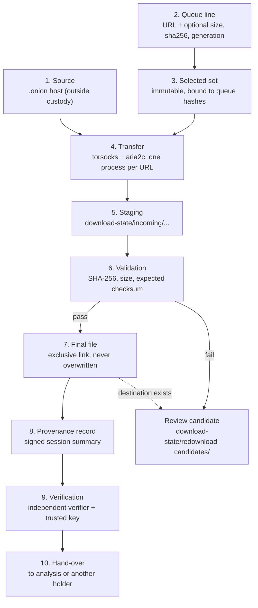
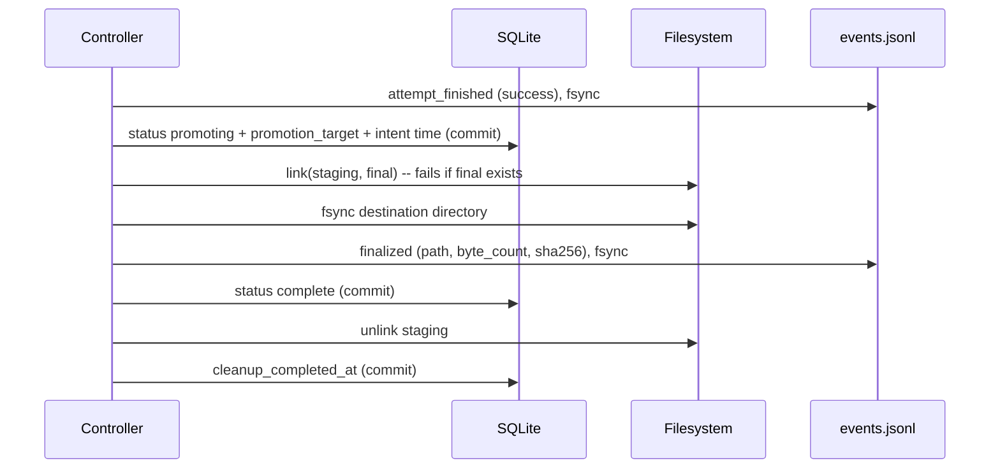
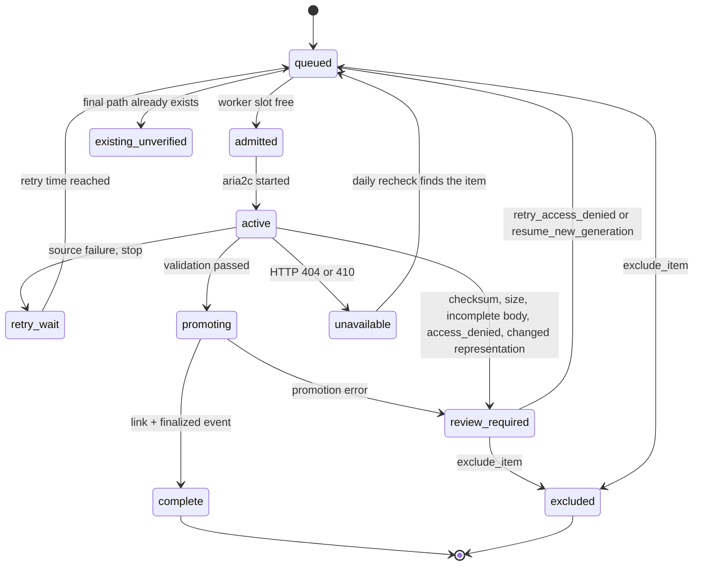

# Chain of custody

Status: describes the code as of 2026-09-18 (commit `d25e07c` plus the
working tree). Sections marked **Planned** describe work that does not exist.

A chain of custody answers: who or what held this file, what happened to it,
and how do we know that nothing changed it between acquisition and use?

This document follows one file from a queue line to a verified final path. It
names each hand-over point, the evidence that TOD-DL records at that point,
and the limits of that evidence. [AUDIT-RAIL.md](AUDIT-RAIL.md) explains the
record format and the verifier in detail. Read it for the gap table (G1 to
G11) that this document cites.

TOD-DL covers the custody segment from **queue line** to **verified final
file on local disk**. It does not cover the source, and it does not cover what
happens after the operator hands the file to another tool or person.

## What the record can and cannot prove

| The record can show | The record cannot show |
| --- | --- |
| A local file at a named path had a stated SHA-256 and byte count when the controller finalized it. | That the source served an original, complete, or authentic file. |
| Which URL, attempt, HTTP status, and response headers led to the file. | That the source content is free of malicious material. |
| The order of events in one session, and that no event changed after writing. | That no session or event is missing (see G3). |
| That a holder of the signing key signed the session summary. | Who held the key (see G2). |
| That the file still matches its recorded digest when the verifier runs. | That no one changed the file between two verifier runs (see G11). |
| That an operator confirmed a control action in the monitor. | Which person confirmed it (see G6). |

## Custody segments



### 1. Source

The source is outside custody. TOD-DL records what the source said in HTTP
response fields: `Content-Length`, `Content-Range`, `Content-Type`, `ETag`,
and `Last-Modified`. It records these as raw strings, or `null`. A validator
that the source did not send is recorded as unavailable. The record does not
invent a value.

### 2. Queue line

A queue file has one URL per line. The controller rejects or ignores blank
lines, comments, duplicates, URLs with credentials, URLs with query values,
and unsafe paths. An unsafe path is absolute, contains `..`, or contains a NUL
byte (for example `/%2Fetc/passwd` or `//passwd`). Such a path could leave the
destination directory.

A line can carry `sha256=<hex>` (an expected digest), `size=<token>` (a rough
size for humans), and `generation=<id>` (an opaque source-generation marker).
An inventory size token is never treated as an expected size.

Keep queue files outside the source repository. They can hold case data.

### 3. Selected set

`--max-files` fixes the selected set. The controller stores the queue file
hashes and the selection value in `manifest.json` under the run ID. On resume,
a different queue hash or a different `--max-files` value stops the run with
`run ID is bound to different queue inputs` or `run ID is bound to different
selection settings`. So a retry cannot add a later item.

The `run_started` provenance event repeats the queue input digests and the
selected item count. The `item_id` of every item event is the SHA-256 of the
source URL.

### 4. Transfer

The controller starts one `aria2c` process per URL through `torsocks`. Before
the run, it checks that the Tor ControlPort uses `IsolateSOCKSAuth` and
records the SOCKS ports in `manifest.json` (`tor_isolation_preflight`).
The controller stops admission if free space falls below the reserve (10 GiB
by default). A disk-full error does not consume a retry attempt.

Each attempt ends with an `attempt_finished` event that holds the URL, the
redirect chain, the HTTP status, the response fields, and the outcome. The
event never contains cookies or credentials. A URL with user-info credentials
is rejected before the writer stores it.

### 5. Staging

`aria2c` writes only to `download-state/incoming/<2 hex>/<rest>`. The path is
the SHA-256 of the URL. The final destination is never a write target during
transfer. The destination and state directories must be on the same
filesystem so that promotion can use a hard link.

A stop that the operator requests (SIGTERM, SIGINT, a control-UI stop, or
`--time-limit`) keeps the partial file. The resumed run continues with an
HTTP Range request. In the source pilot, a resumed 2.7 MB transfer completed
after an HTTP 206 answer, and fresh full downloads of three files were
byte-identical to the resumed files (`specs/reports/source-pilot-2026-09-18.md`).

If a resume finds a changed or unconfirmed remote representation (ETag or
Last-Modified), the item moves to `review_required`. The controller does not
resume into stale bytes. The operator can start a new staging generation
with `resume_new_generation`.

### 6. Validation

The controller hashes one staged file at a time. Then it applies these checks
in order:

1. If a `sha256=` value exists and the digest differs: `review_required` with
   code `checksum_mismatch`.
2. If the final response announced a full size and the staged byte count
   differs: `review_required` with code `size_mismatch`.
3. Otherwise the file may be promoted.

An incomplete body gets one retry. If a second attempt makes no progress, the
item enters `review_required`. HTTP 401 and 403 enter `review_required` with
code `access_denied`. The controller does not retry or try to get around the
access control. HTTP 404 and 410 record `unavailable` and trigger a daily
recheck.

After a checksum mismatch, a size mismatch, an incomplete body that stays
short after the retry, or a destination collision, the controller moves the
staged file to `download-state/redownload-candidates/` with `link` and
`unlink`, and writes a `candidate_created` event. The candidate keeps a
unique random name. The controller does not mark a candidate as evidence.
An `access_denied` item keeps its staged bytes in `incoming/` and writes no
candidate.

### 7. Final file

Promotion follows this order. The rule behind the order: **the intent is
durable before the file appears, and the file is durable before the event.**



Three rules protect the final file:

- **No overwrite.** `os.link()` creates the final path exclusively. If the
  path exists, the call fails. The controller then moves the incoming bytes to
  `redownload-candidates/` and records `destination_collision`. The existing
  final stays as it was.
- **Safe path.** Before promotion, the controller checks that no parent of the
  target is a symlink and that the destination itself is not a symlink.
- **No silent skip.** If a final file already exists when an item starts, the
  item becomes `existing_unverified`. The controller records its byte count
  but no digest, and writes no `finalized` event. Such a file is **outside**
  the signed chain. Treat it as unverified.

### 8. Provenance record

The controller writes `events.jsonl`, `schema.json`, and (at a clean close)
`summary.json` under `download-state/provenance/<run-id>/<session-id>/`.
[AUDIT-RAIL.md](AUDIT-RAIL.md) describes the format.

Each `finalized` event links these facts: the item, the exact URL, the
logical and final relative paths, the byte count, the SHA-256, the
validation method version, the time, and four validation objects
(`expected_size`, `expected_checksum`, `etag`, `last_modified`). Each object
states whether the value was available and whether the controller compared it.
A reader can see the strength of the check, not only its result.

### 9. Verification

The verifier recomputes the chain, checks the signature with a key that the
operator trusts, and rehashes each final file. It never modifies anything.
See [AUDIT-RAIL.md](AUDIT-RAIL.md#the-verifier).

### 10. Hand-over

TOD-DL has no hand-over feature. The operator must choose what to give the
next holder. The recommended bundle is:

- the `downloaded_files/` tree,
- the whole `provenance/<run-id>/` directory (all sessions),
- the queue files, and the `manifest.json` of the run,
- the trusted public key, with its fingerprint given by a separate route,
- `manifest.sqlite`, if the receiver needs the transition and control history.

The receiver runs the verifier with its own copy of the key fingerprint.

## Lifecycle of one item



The controller writes each durable status change and its `download_transitions`
row in one SQLite transaction (`transition()`). The diagram shows the main
paths. It simplifies the retry and admission arrows and omits `failed` and a
few recovery transitions. `specs/SPEC-reliable-acquisition.md` defines the
full table.

## Review and operator actions

An item in `review_required` needs a human decision. The controller does not
fix it by itself. Use `--status` to list these items with their `review_code`
and `last_error`.

| Action | Applies to | Effect | Monitor key |
| --- | --- | --- | --- |
| `exclude_item` | Any excludable state | Moves the item to `excluded`. Other items keep their state and rank. The controller never applies this action on its own. | `x` |
| `resume_new_generation` | `changed_remote_representation`, `no_reliable_version_protection` | Clears the review code, starts a new staging generation, and returns the item to `queued`. | `N` |
| `retry_access_denied` | `access_denied` | Returns the item to `queued` with its bytes and attempts. Ends the origin pause when no other such item of the origin remains. | `A` |

Every action needs a confirmation in the monitor. The controller writes a
`control_requests` row with the request ID, action, outcome, reason, and state
revision. A repeated request ID returns the first result. There is no
"approve candidate as final" action. A candidate never becomes a final file
through TOD-DL.

## Crash recovery and custody

The controller can die at any step. The SQLite state and the provenance files
let the next start decide what is true.

| Crash point | State on disk | Recovery on next start |
| --- | --- | --- |
| Before `promoting` commit | Staging exists, no intent | The item transfers or validates again. |
| After `promoting` commit, before `link` | Intent in SQLite, no final file | `reconcile_promotions()` links staging to the target if the target path is free, then writes the `finalized` event. |
| After `link`, before the `finalized` event | Final file exists, no event | Recovery hashes the final file. If it matches the stored digest, it writes the `finalized` event and marks the item `complete`. |
| After the `finalized` event, before the `complete` commit | Event exists, status is `promoting` | Recovery hashes the final file and writes a `finalized` event in the new session. The earlier session keeps its own event (see G5). |
| Any other inconsistency | Unclear | The item enters `review_required` with `promotion reconciliation requires review`. |

The named failpoints `post_validation_intent`, `post_final_file_creation`, and
`post_completion_commit` test three of these windows. Other windows (staging
cleanup, shutdown) have no named test (G9).

A hard kill leaves a session with no signed summary (G1). The next start
opens a new session directory, and the verifier checks each session on its
own. Each summary records `session_finalized_count`, so a resumed session that
finalizes fewer files than the run total still verifies.

## Operator runbook

**Before the run**

1. Create the case directory. Keep queues, state, and destination there.
2. Set `--provenance-signing-key` to a path you control, or plan to copy the
   default key out of the state directory after the first run.
3. Run a dry run and read the selected paths.

**After the first session**

1. Copy the public key to storage outside the state directory.
2. Compute the fingerprint. It is the SHA-256 of the 32 raw public-key bytes.
   The verifier prints a mismatch if you give a wrong one.
3. Store the fingerprint in a second place (a case note or a signed message).

**After each session**

1. Run the verifier with `--public-key` and `--expected-fingerprint`.
2. If the output is not `OK`, keep all files as they are. Read each `FAIL:`
   line. Do not repair or delete evidence.
3. List `review_required` items with `--status` and decide each one.

**An independent check that does not use the verifier**

This command lists each `finalized` digest and checks the file. It is a
second opinion for the digests only. It does not check the chain or the
signature.

```bash
jq -r 'select(.event_type=="finalized") | "\(.sha256)  \(.final_relative_path)"' \
    /case/download-state/provenance/RUN_ID/SESSION_ID/events.jsonl \
  | (cd /case/downloaded_files && sha256sum -c -)
```

Expected output for a good file: `c/a.bin: OK`. (I ran this command on
synthetic data on 2026-09-18.)

**Before hand-over**

1. Run the verifier for every session of the run.
2. Run the independent check above.
3. Record the verifier output, the date, and the fingerprint you used.
4. Copy the bundle listed in "10. Hand-over".

## Risks that the operator must handle

| Risk | Why it matters | What the operator can do today |
| --- | --- | --- |
| Key in the state directory (G2) | Someone who can write the state and read the key can forge a record set. | Move or copy the key out. Restrict access to the state directory. |
| Missing session (G3) | The verifier cannot detect a deleted session directory. | Keep a list of session IDs from the run's log output. Copy each session directory to write-once storage after it closes. |
| Post-promotion change (G11) | The controller does not watch final files. | Use a read-only mount or file mode. Run the verifier on a schedule. |
| `existing_unverified` files | They have no digest in the chain. | Hash them yourself and record the result. |
| Local clock (G10) | Timestamps come from the host clock. | Keep the host on a trusted time source. Record the source in the case note. |

## Related files

- [AUDIT-RAIL.md](AUDIT-RAIL.md)
- [PORTFOLIO-OVERVIEW.md](PORTFOLIO-OVERVIEW.md)
- [specs/SPEC-reliable-acquisition.md](../specs/SPEC-reliable-acquisition.md)
- [specs/SPEC-acquisition-provenance.md](../specs/SPEC-acquisition-provenance.md)
- [specs/reports/source-pilot-2026-09-18.md](../specs/reports/source-pilot-2026-09-18.md)
